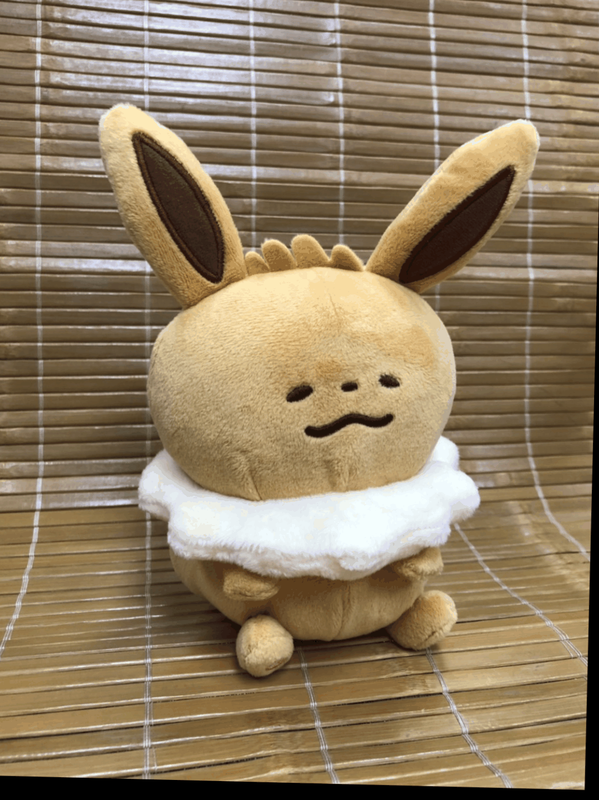

ISA525700 Computer Vision for Visual Effects Homework 5
===

## Our multi-view images

我們總共拍攝了四組照片，前兩組用來做Motion Parallax，後兩組用來做Stop Motion。

|||
|---|---|

|||
|---|---|

||||||
|---|---|---|---|---|

||||
|---|---|---|
||||

## Image alignment results

我們將兩兩配對的圖片第二張對第一張進行align。

|Feature Matching|Image Alignment|
|---|---|
|||
|||

## Multi-view 3D visual effects

### Motion parallax

在Motion Parallax的部分我們一開始是直接將第一張圖片還有第二張對第一張進行align的圖片串聯起來，如此就達到了還不錯的效果，可以看到在直接串連原始圖片的部分有直接旋轉角度的感覺，經過了Image Alignment，因為我們特地挑選過圖片的關係，Feature Match都有抓在主體的部分，所以主體的改變幅度縮小，背景的改變幅度相對變大，之後我們又透過Photoshop來修圖，直接把第一張圖片的主體剪下來貼到align圖片的同一個位置，如此主體就幾乎可以說是沒有動，而背景則大幅度移動，更有以主體為中心的感覺。

#### 卡納赫拉伊布

卡納赫拉伊布的背景因為比較近，所以效果較不明顯，不過觀察左上角的反光再比較卡納赫拉伊布的旋轉角度，還是可以發現有達到Mation Parallax的目的。

|Original|Image Alignment|+ Photoshop|
|---|---|---|
||||

#### 謎你Q

謎你Q的背景因為比較遠，所以效果明顯很多，而且因為有景深的關係，也能更準確抓到謎你Q的Feature Points，在Image Alignment的部分效果就非常好了，再加上Photoshop則是更凸顯效果。

|Original|Image Alignment|+ Photoshop|
|---|---|---|
||||

### Stop motion

在Stop Motion的部份我們嘗試使用Image Alignment的方法之後，發現效果不是很好，圖片主角容易過度扭曲，且非常容易受背景影響，因此我們參考了Video Stabilization的實作方式：
1. 尋找第一張圖片(相當於影片中的第一個frame)中合適的Feature
2. 藉由Lucas-Kanade Optical Flow的演算法在第二張圖片(相當於影片中的第二個frame)中尋找相對應的Feature Points
3. 利用相對應的兩組Feature Points去計算Rigid  Transformation的矩陣
4. 藉由Transformation的矩陣取得Translation和Rotation
5. 對第二張圖片和第三張圖片、第三張圖片和第四張圖片......重複步驟1~4，以取得移動軌跡
6. 平滑移動軌跡，並以此計算新的Transformation矩陣
7. 根據新的Transformation矩陣來達到將多角度的照片串聯成穩定Stop Motion的效果
經過Optical Flow的處理，整體效果比較穩定，利用一台手機就可以製造出多台環繞的效果，比較可惜的是，這樣的方式不適用於主體會動的效果像是範例中人跳起來或是披風會動。

#### 卡納赫拉伊布

經過Optical Flow的處理，整體效果比較穩定，但是椅子的旋轉幅度較小。

|Original|Optical Flow|
|---|---|
|||

#### 花語清華

經過Optical Flow的處理，整體效果比較穩定，但是花的旋轉幅度較小。

|Original|Optical Flow|
|---|---|
|||

## Image processing

1. 景深：在做Motion Parallax的時候，因為要避免抓到背景的Feature Points，所以我們在謎你Q的那組照片製造了景深的效果，讓背景糊化，主體相對清晰，如此更容易抓到主體的Feature Points。
2. Photoshop：直接把第一張圖片的主體剪下來貼到align圖片的同一個位置，完全去除主體的變動，達到更好的效果。
3. Mask：一開始我們其實是使用坐在黑綠椅子上的卡納赫拉伊布做Motion Parallax，但因為Feature會一直抓到椅子，所以我們嘗試使用Photoshop來做一個mask限制他，可是效果仍然不是很好，試了方框的mask和沿著娃娃做的mask都失敗，所以後來我們就重新拍了一組照片。

|||||
|---|---|---|---|
|||||

## Bonus

### Motion parallax
同上

### Stop motion
同上

### Live Photo

在這個部分我們對三種方法進行比較，首先，Original Live Photo是原本用iPhone原況照片模式拍出來的，他是直接紀錄使用者拍攝照片前後1.5秒的動態，並沒有進行處理，因此若是手在這3秒內有晃動到，Live Photo就會如實地呈現出來，接著，Motion Still是將前述的Live Photo放進Motion Still的APP裡面讓他進行穩定的結果，可以從結果中看到效果非常好，基本上只有貓、手和後面的人車有在動，整體非常穩定，最後的Optical Flow跟前面的Stop Motion一樣，是利用video stabilization的結果來達到穩定的效果，可以看到也是相當穩定，只是邊緣偶爾會有一些因為Image Alignment造成圖片歪斜扭曲導致的黑框，再做Crop把邊緣切掉只留中間效果應該會更好，不過為了讓三個結果的視野一致，我們就沒有再做這部份了。

|Original Live Photo|Motion Still|Optical Flow|
|---|---|---|
||||
